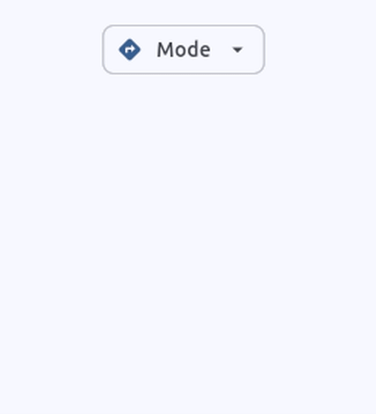

A lightweight and customizable Flutter package that combines a filter chip with a dropdown menu. 
Perfect for creating selection interfaces where users need to choose from multiple options 
in a compact, intuitive UI component.

[](https://pub.dev/packages/menu_chip)
[](https://opensource.org/licenses/MIT)
[](https://flutter.dev)

## Features

- Filter chip with integrated dropdown menu
- Customizable appearance (colors, icons, text)
- Lightweight with minimal dependencies
- Easy integration with existing Flutter projects
- Follows Material Design 3 guidelines by default



Based on [Material Design 3](https://m3.material.io/components/chips/guidelines)

## Getting started

To add the menu_chip to your Flutter application follow the [installation instructions](https://pub.dev/packages/menu_chip/install) on pub.dev.

## Usage

Example:

```dart
import 'package:menu_chip/menu_chip.dart';

final _key = GlobalKey<PopupMenuButtonState>(); // Place it as higher in your active widget tree as possible
Srting? _chipValue;

MaterialMenuChip(
    menuKey: _key,
    menuItemsList: [
        MenuChipItem(
            value: 'option1',
            label: Text('Option 1'),
            avatar: Icon(Icons.star),
         ),
        MenuChipItem(
            value: 'option2', 
            label: Text('Option 2'),
            avatar: Icon(Icons.favorite),
        ),
    ],
    selectedValue: _chipValue,
    onSelectionChanged: (value) {
        print('Selected: $value');
    },
    chipLabel: Text('Filter'),
);
```
